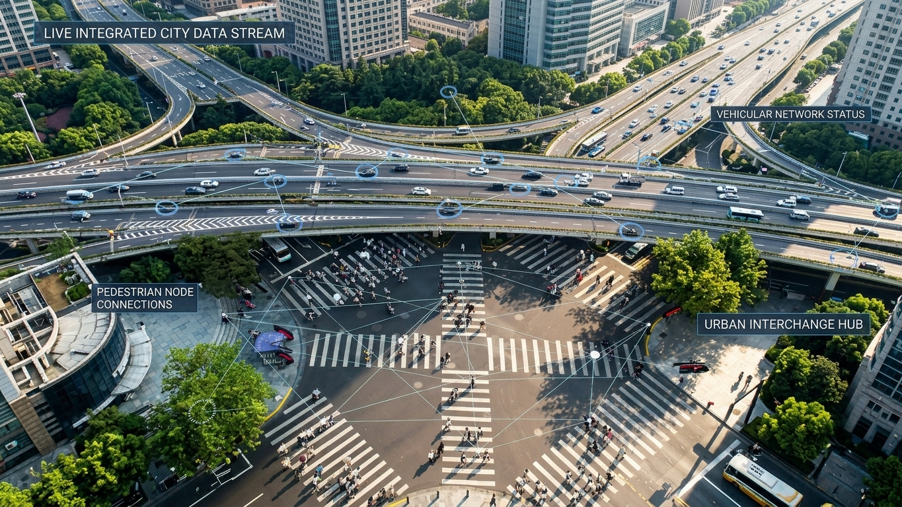
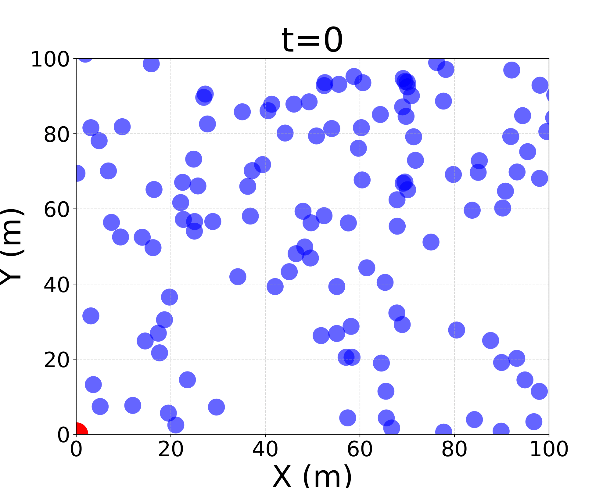
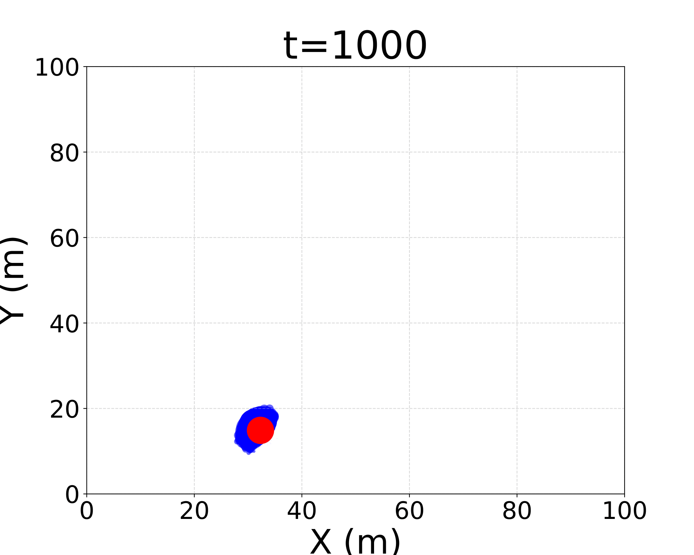
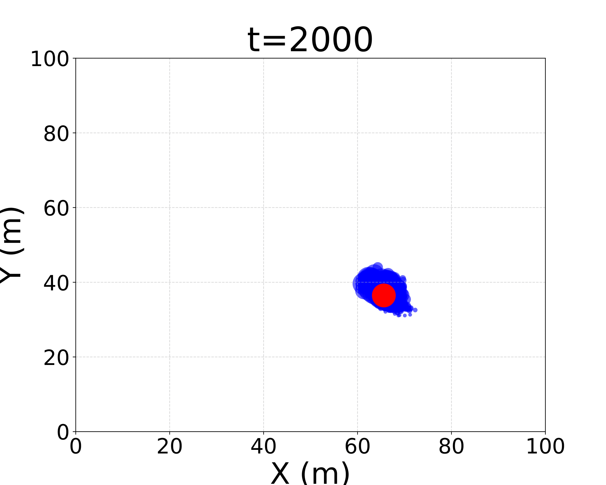
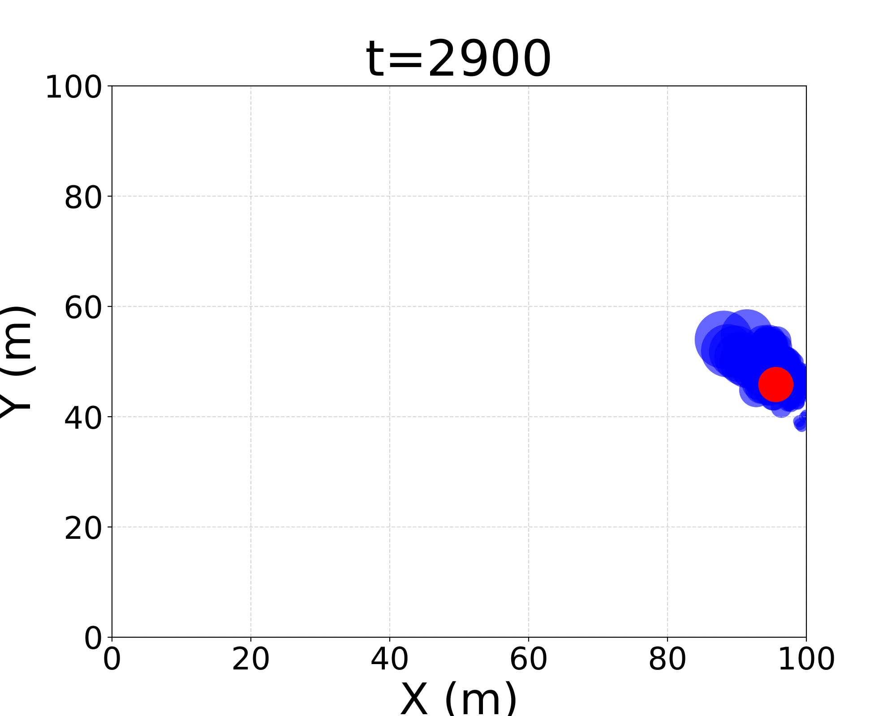
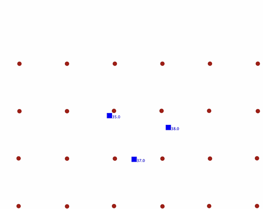

+++
title = "Multi-Target Tracking via Field-Based Distributed Particle Filtering"
description = "ACSOS 2026 presentation"
outputs = ["Reveal"]
+++

# Multi-Target Tracking via Field-Based Distributed Particle Filtering

{}

[**Angela Cortecchia**](mailto:angela.cortecchia@unibo.it),
[Davide Domini](mailto:davide.domini@unibo.it),
[Giovanni Ciatto](mailto:giovanni.ciatto@unibo.it),
[Roberto Casadei](mailto:roby.casadei@unibo.it), and
[Mirko Viroli](mailto:mirko.viroli@unibo.it)

{}

*Department of Computer Science and Engineering (DISI) 
Alma Mater Studiorum — University of Bologna, Cesena, Italy*

  

---

# Motivation: distributed estimation in changing environments



Many cyber-physical systems estimate a **hidden dynamical state** from distributed, noisy observations.

But the sensing system changes too:

- devices move, fail, or disconnect;
- topology and observability vary;
- different devices become relevant over time.
  




**Challenge:** keep the estimate reliable while the organization producing it changes.


---

# Particle filters maintain a distribution of plausible states



**01 · Predict** — Where could the state move next?

**02 · Weight** — Which hypotheses agree with the observations?

**03 · Resample** — Keep plausible hypotheses; discard unlikely ones.

**04 · Estimate** — Use the particles to represent the current belief.


<strong>The estimate is a distribution, not only a point.</strong>



---

# Particle Filter Over Time

  

    
    
t = 0

    
many possible hypotheses

  

  

    
    
t = 1000

    
belief concentrates

  

  

    
    
t = 2000

    
the cloud follows the target

  

  

    
    
t = 2900

    
uncertainty remains explicit

  


The particle cloud follows the target while keeping the estimation error visible as uncertainty.


---

# Distribution turns filtering into a coordination problem



All observations are available to a single estimator.

$$p(x_t \mid y_{1:t})$$



Each device observes only local information.

$$y_{t,k} = h_k(x_t, v_{t,k})$$



Different DPF approaches mainly differ in **where fusion happens, what is exchanged, how far information propagates, and which nodes participate**.




The filtering objective stays the same; the coordination strategy changes.


---

# Conventional DPF architectures are rigid by design



Fusion centers, leaders, communication patterns, and participating nodes are typically defined in advance.



Failures, mobility, topology changes, or shifting observability often require specialized algorithm variants.




**Core issue:** filtering semantics and coordination mechanisms are tightly coupled.


---

# Aggregate Computing makes collective coordination programmable

### A macroprogramming approach to distributed systems





Aggregate Computing describes the **collective behavior** of a system instead of programming each device separately.

Programs manipulate **computational fields**: distributed values that evolve across the network.

  spreadaggregateconvergeelect





Devices execute local code, while the programmer reasons in terms of global coordination patterns.


---

# One collective program becomes an evolving computational field



**01 · Collective specification** 
The programmer describes the behavior of the device network.

**02 · Local rounds** 
Each device evaluates the same program using sensors, memory, and neighbor messages.

**03 · Emergent field** 
The collection of local values forms the global computational field.



1. **Sense** inputs and incoming neighbor messages.
2. **Compute** new local state and outbound messages.
3. **Interact / Act** by sharing results and affecting the environment.



The model does not require global lockstep.



---

# Keep particle filtering standard; make coordination adaptable

This is not another DPF algorithm. It is a programmable coordination layer around established filtering logic.



- prediction
- weighting
- resampling
- estimation



- where information is fused;
- what information is exchanged;
- how far information propagates;
- which devices participate;
- which devices take coordination roles.




Architectural assumptions become composable choices that can evolve at runtime.


---

# One field-based model supports multiple adaptive organizations



- **Self-organization** through local neighborhood interactions
- **Self-healing** through runtime role reassignment after failures
- **Self-adaptation** to target motion and changing spatial conditions



- neighborhood-level measurement aggregation
- leader-based fusion with dynamic leader election
- decentralized estimation with fixed or mobile observers
- adaptive spatial participation and coordination regions




The filtering logic remains constant; the collective reorganizes around it.


---

# Experimental Evaluation

  

    <h3>Scenario</h3>
    

      Alchemist Simulator
      Collektive DSL
      2D environment
      24 sensors
      3 moving targets
      50 seeds · 1 Hz
    

    
Target trajectories derive from the <strong>KABR wildlife telemetry dataset</strong>.

    
Each target emits a radio-like signal: closer sensors receive stronger, cleaner evidence; farther sensors receive weaker, noisier evidence.

  

  

    <h3>Evaluated configurations</h3>
    

      1
      
<strong>Neighborhood measurement aggregation</strong> Each sensor runs a local PF; only measurements are shared.

    

    

      2
      
<strong>Leader-based fusion</strong> Measurements converge toward an elected, replaceable leader.

    

    

      3
      
<strong>Mobile sensing infrastructure</strong> Sensors reorganize spatially around the moving targets.

    

  

---

# Experiment 1: neighborhood sharing improves local estimates



Each sensor runs its **own multi-target particle filter**.

Sensors exchange target-indexed measurements—not particle sets—and combine neighbor observations in the likelihood computation.

$$|\mathcal{N}| \in \{0, 1, 4, 7\}$$



Limited spatial information produces poor convergence and unstable estimates.



Aggregated measurements improve tracking accuracy and stability.






Neighborhood size becomes an explicit coordination parameter.


---

# Measurement sharing sharply reduces tracking error





- With little or no sharing, local filters may remain inaccurate or fail to converge.
- Increasing $|\mathcal{N}|$ reduces RMSE and improves stability.
- Particle sets remain local; only measurements are exchanged.
- Larger neighborhoods trade communication for estimation quality.




Local cooperation supports decentralized multi-target tracking without a fusion center.


---

# Experiment 2: the fusion role survives leader failure



**01 · Election** 
A geometrically central active sensor becomes leader.

**02 · Fusion** 
Measurements converge toward the leader.

**03 · Failure** 
The current leader is removed during execution.

**04 · Recovery** 
A new leader is elected; tracking resumes after a short transient.






The fusion-center role persists even when the device holding that role does not.


---

# Experiment 3: mobile sensors preserve informative observations



- Every sensor continues to run a local multi-target particle filter.
- Filtering remains decentralized.
- A temporary coordinator manages motion only.
- Sensors preserve a grid-like formation.
- The formation centroid follows the estimated target centroid.

Observation quality then depends on how well the formation keeps up.





---

# Tracking accuracy bounds estimation accuracy





- **Tracking error**: how far the sensors stay from the position they follow.
- RMSE grows **super-linearly**: 2 m at 0, ~26 m at 200, ~59 m at 300.
- Sensors that lag behind receive a weaker, noisier signal.




Mobility buys accuracy only in proportion to how well the collective keeps up.


---

# The same formulation enables three self-* properties



Neighborhood interactions improve estimation without central coordination.



A failed fusion leader is replaced at runtime while the collective behavior persists.



Mobile observers reorganize as the tracked targets move.




The key result is not one DPF configuration, but multiple adaptive organizations emerging from one field-based formulation.


---

# Field-based DPF separates estimation from coordination



- DPF becomes a **self-organizing collective process**.
- One estimation substrate supports multiple organizations.
- Local cooperation, leader replacement, and mobile observers expose three self-* properties.
- Neighborhood size, connectivity, and spatial configuration shape estimation quality.



- spatially adaptive filtering and selective activation
- self-organizing coordination regions
- larger target populations
- richer deployment conditions
- heterogeneous sensing modalities
- accuracy, communication, resilience, and scalability trade-offs



---

# Thank you for the attention!

{}

### Reproducible experiments here:



GitHub: <i class="fa-brands fa-github"></i> **[domm99/experiments-acsos-2026-DPF-multi-object-tracking](https://github.com/domm99/experiments-acsos-2026-DPF-multi-object-tracking)**
